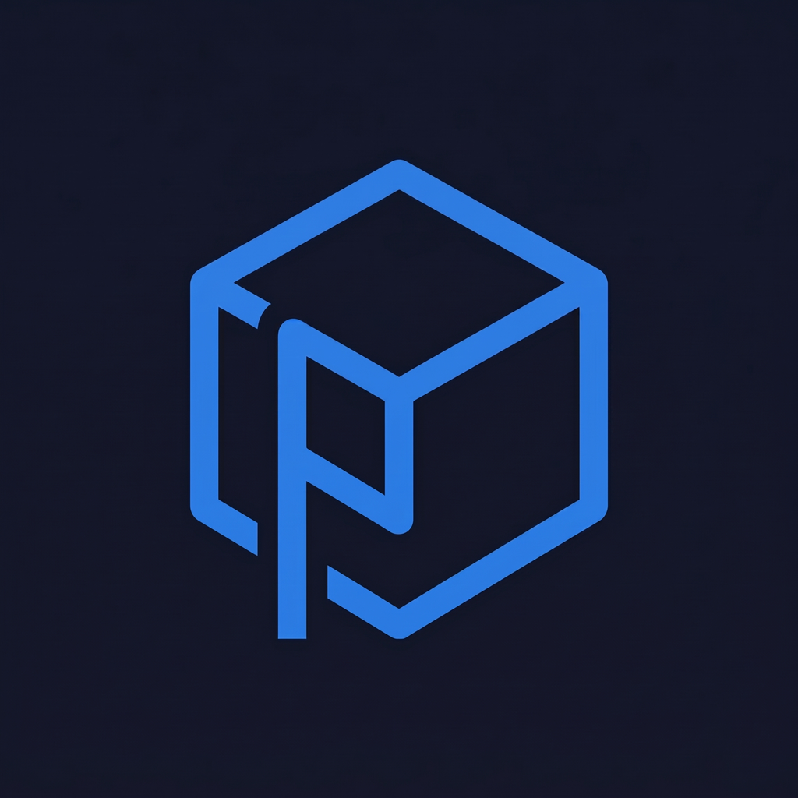

<div align="center">



# Pyx

**Throw files at the computer next to you. That's it.**

No cloud, no USB stick, no accounts. Open Pyx on two machines on the same Wi-Fi,
drag a file (or a whole folder) onto the other one, and it just goes — straight
across, encrypted, fast.

</div>

---

## the idea

You know the annoying dance of sending a big file to the laptop across the room?
Upload to Google Drive, wait, download on the other side, delete it later. Or dig
out a flash drive. Pyx skips all that.

It runs on each machine, automatically spots the others on your network, and lets
you drag stuff straight onto them. The bytes go directly between the two computers
— they never touch a server.

## what it does

- **Encrypted** — everything goes over an encrypted QUIC connection, and each file
  gets a checksum so you know it arrived intact.
- **Fast** — it's a direct connection, so you get your network's real speed. No
  upload-then-download round trip.
- **Files *and* folders** — drag a single file, a pile of files, or a whole folder.
  The folder shows up on the other side exactly how it looked.
- **Nothing to set up** — the apps find each other on their own. No IP addresses,
  no codes, no sign-up.
- **You're in control** — the other person has to accept before anything lands on
  their disk, and your files never leave your network.
- **Pick where stuff lands** — set your download folder; it remembers.
- **Updates itself** — quietly keeps itself current.

## how you use it

1. Open Pyx on two devices on the same Wi-Fi.
2. They show up as little cards in each other's window.
3. Drag files or a folder onto the one you want to send to.
4. They hit Accept, and it flies over into their downloads.

Done.

## what's under the hood

- [Tauri 2](https://tauri.app) (Rust) for the app shell
- React 19 + TypeScript + Vite for the UI
- [`quinn`](https://github.com/quinn-rs/quinn) (QUIC) + `rustls` for the actual transfer
- [`mdns-sd`](https://github.com/keepsimple1/mdns-sd) so devices find each other
- [`blake3`](https://github.com/BLAKE3-team/BLAKE3) for the integrity checks
- `tokio` doing the async heavy lifting

## where things live

```
src/                 the React UI
src-tauri/src/
  discovery.rs       finding other devices (mDNS)
  transport.rs       QUIC setup + the self-signed cert
  send.rs            sending stuff (folder walking + streaming)
  receive.rs         receiving stuff
  protocol.rs        the little messages the two sides exchange
  fileutil.rs        keeping filenames/paths safe
  hash.rs            blake3 wrapper
  state.rs           app state + settings
  commands.rs        the bridge between UI and Rust
```

## running it yourself

You'll need [Rust](https://rustup.rs), [Node](https://nodejs.org), and the
[Tauri prerequisites](https://tauri.app/start/prerequisites/) for your OS.

```bash
npm install
npm run tauri dev      # fire it up
```

Build a real installer:

```bash
npm run tauri build
```

Run the tests (these actually spin up a real QUIC transfer):

```bash
cd src-tauri
cargo test
```

## heads up

- Both devices have to be on the **same network** (same subnet). Guest Wi-Fi and a
  lot of office/school networks block the discovery, so those won't work.
- Let Pyx through the firewall on **private networks** when Windows asks. If you
  click away that popup, the devices won't see each other.
- The accept prompt is the only thing standing between you and a random file, so
  use it on networks you actually trust.

## license

MIT — do whatever.
